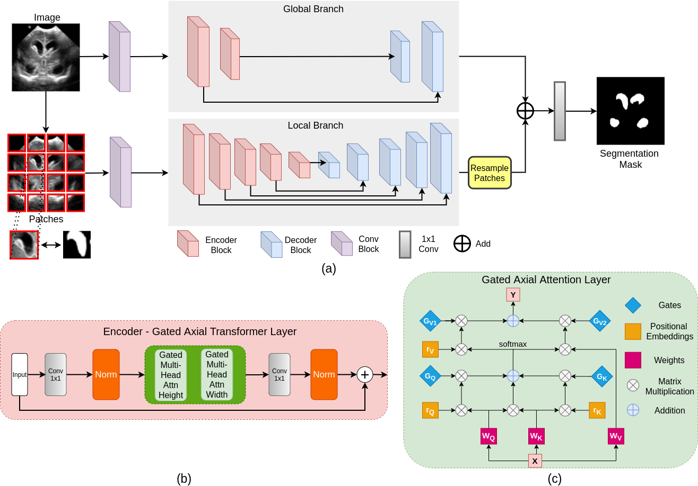

# Medical-Transformer

 <a href="https://arxiv.org/abs/2102.10662"> </a> 

Pytorch code for the paper 
["Medical Transformer: Gated Axial-Attention for
Medical Image Segmentation"](https://arxiv.org/pdf/2102.10662.pdf), MICCAI 2021

### About this repo:

This repo hosts the code for the following networks:

1) Gated Axial Attention U-Net
2) MedT

## Introduction

Majority of existing Transformer-based network architectures proposed for vision applications require large-scale
datasets to train properly. However, compared to the datasets for vision
applications, for medical imaging the number of data samples is relatively
low, making it difficult to efficiently train transformers for medical appli-
cations. To this end, we propose a Gated Axial-Attention model which
extends the existing architectures by introducing an additional control
mechanism in the self-attention module. Furthermore, to train the model
effectively on medical images, we propose a Local-Global training strat-
egy (LoGo) which further improves the performance. Specifically, we op-
erate on the whole image and patches to learn global and local features,
respectively. The proposed Medical Transformer (MedT) uses LoGo training strategy on Gated Axial Attention U-Net.

<p align="center">
  
</p>

### Using the code:

- Clone this repository:
```bash
git clone https://github.com/jeya-maria-jose/Medical-Transformer
cd Medical-Transformer
```

The code is stable using Python 3.6.10, Pytorch 1.4.0

To install all the dependencies using conda:

```bash
conda env create -f environment.yml
conda activate medt
```

To install all the dependencies using pip:

```bash
pip install -r requirements.txt
```

### Links for downloading the public Datasets:

1) MoNuSeG Dataset - <a href="https://monuseg.grand-challenge.org/Data/"> Link (Original)</a> 
2) GLAS Dataset - <a href="https://warwick.ac.uk/fac/sci/dcs/research/tia/glascontest/"> Link (Original) </a> 
3) Brain Anatomy US dataset from the paper will be made public soon !

## Using the Code for your dataset

### Dataset Preparation

Prepare the dataset in the following format for easy use of the code. The train and test folders should contain two subfolders each: img and label. Make sure the images their corresponding segmentation masks are placed under these folders and have the same name for easy correspondance. Please change the data loaders to your need if you prefer not preparing the dataset in this format.


```bash
Train Folder-----
      img----
          0001.png
          0002.png
          .......
      labelcol---
          0001.png
          0002.png
          .......
Validation Folder-----
      img----
          0001.png
          0002.png
          .......
      labelcol---
          0001.png
          0002.png
          .......
Test Folder-----
      img----
          0001.png
          0002.png
          .......
      labelcol---
          0001.png
          0002.png
          .......

```

- The ground truth images should have pixels corresponding to the labels. Example: In case of binary segmentation, the pixels in the GT should be 0 or 255.

### Training Command:

```bash 
python train.py --train_dataset "enter train directory" --val_dataset "enter validation directory" --direc 'path for results to be saved' --batch_size 4 --epoch 400 --save_freq 10 --modelname "gatedaxialunet" --learning_rate 0.001 --imgsize 128 --gray "no"
```

```bash
Change modelname to MedT or logo to train them
```

### Testing Command:

```bash 
python test.py --loaddirec "./saved_model_path/model_name.pth" --val_dataset "test dataset directory" --direc 'path for results to be saved' --batch_size 1 --modelname "gatedaxialunet" --imgsize 128 --gray "no"
```

The results including predicted segmentations maps will be placed in the results folder along with the model weights. Run the performance metrics code in MATLAB for calculating F1 Score and mIoU. 

### Notes:

1)Note that these experiments were conducted in Nvidia Quadro 8000 with 48 GB memory. 
2)Google Colab Code is an unofficial implementation for quick train/test. Please follow original code for proper training.

### Acknowledgement:

The dataloader code is inspired from <a href="https://github.com/cosmic-cortex/pytorch-UNet"> pytorch-UNet </a>. The axial attention code is developed from <a href="https://github.com/csrhddlam/axial-deeplab">axial-deeplab</a>. 

# Citation:

```bash
@article{valanarasu2021medical,
  title={Medical Transformer: Gated Axial-Attention for Medical Image Segmentation},
  author={Valanarasu, Jeya Maria Jose and Oza, Poojan and Hacihaliloglu, Ilker and Patel, Vishal M},
  journal={arXiv preprint arXiv:2102.10662},
  year={2021}
}
```

Open an issue or mail me directly in case of any queries or suggestions. 
